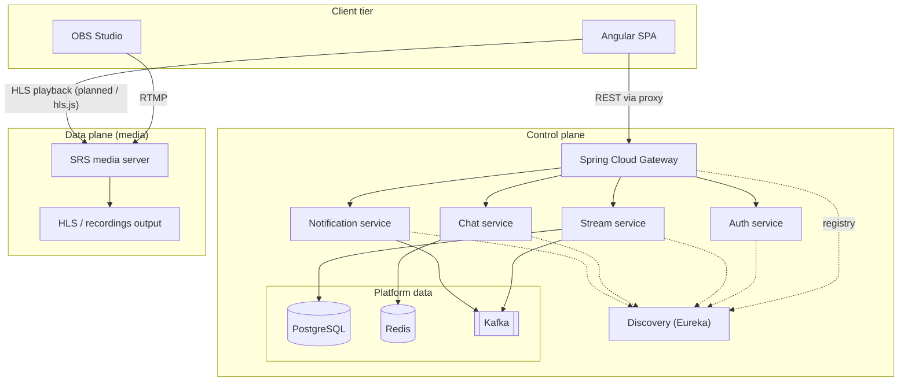
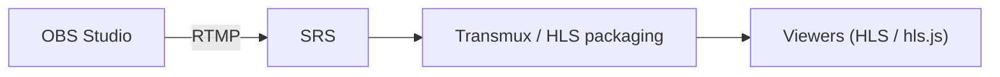

# Live Streaming Platform — Architecture Overview

**Document purpose.** This overview describes the high-level architecture of the POC for stakeholders who need a clear picture of components, boundaries, and how the system scales, without committing to implementation minutiae.

---

## 1. What this POC demonstrates

This project shows a **dual-plane** streaming platform optimized for learning and incremental delivery:

- **Data plane.** Real-time media ingestion, packaging, and delivery (OBS → media server → HLS-capable playback).
- **Control plane.** Product features: identities, stream metadata lifecycle, chat, notifications, orchestration signals, backed by synchronous APIs plus **event-driven** integration (**Kafka**) and shared state (**Redis**, **PostgreSQL**).

Infrastructure is runnable locally (**Docker Compose**) so a single developer can validate end-to-end behavior before evolving toward production posture.

Control-plane services are built as a **Gradle** multi-project under `backend/`, using **Java 21 toolchains provisioned as GraalVM Community** (ideal for running the same JVM on laptops and in the discovery Docker image). **Graal Native Image** (`nativeCompile`) is intentionally not wired: Spring Cloud Netflix (Eureka) still trips Spring Boot **AOT** for this stack; revisit when your dependencies publish complete native support or you replace discovery with a Graal-friendly registry.

---

## 2. System context (two planes)

**Takeaway for the client.** Business logic and media delivery are **separated**: the browser talks to your **API gateway** for product features, while **live video** is delivered from the **media path** (SRS / HLS) without forcing all video bytes through Spring.

---

## 3. Control plane — components and roles

| Component | Role |
|-----------|------|
| **Angular (PrimeNG)** | Operator and viewer UI; calls APIs through the gateway (dev proxy in local runs). |
| **API Gateway** | Single entry point for REST; **CORS** at the edge; routes to backends. With **discovery**, routes use logical service names (**`lb://…`**) so the gateway behaves as a **client-side load balancer** across instances. |
| **Discovery (Eureka)** | **Service registry**: instances register on startup; the gateway resolves healthy targets for scaling out across hosts. |
| **Auth service** | Identity and authorization boundary (current scaffold: MVC security + placeholders for hardened auth). **PBAC + JWT design:** see [`docs/PBAC-AUTHORIZATION.md`](PBAC-AUTHORIZATION.md). |
| **Stream service** | Stream keys, lifecycle metadata orchestration (**Kafka** publisher in scaffold), persistence via **PostgreSQL** (reactive DB access baseline). Intended integration: SRS webhooks for key validation and events. |
| **Chat service** | Room-style messaging backed by **Redis** (simple list backlog in scaffold; replaceable with pub/sub or dedicated chat stack). |
| **Notification service** | Consumes **Kafka** topics (scaffold listens for stream-oriented events); natural place for push, email hooks, or internal fan-out later. |

**Supporting infrastructure (Compose).**

| System | Typical use in this design |
|--------|----------------------------|
| **PostgreSQL** | Durable metadata (users, streams, archives, audits). |
| **Redis** | Low-latency chat / ephemeral presence / rate limits as you evolve. |
| **Kafka** | Decouple producers (e.g. stream lifecycle) from consumers (notifications, analytics, indexing). |
| **Eureka** | Dynamic routing when services move to additional servers without hardcoding IPs in the gateway. |

---

## 4. Data plane — media path

- **SRS** handles publisher ingest and HTTP delivery of packaged media (HLS configuration is part of the POC baseline).
- **FFmpeg** can sit in the pipeline for transcoding or offline processing as requirements harden (not mandatory for the first demo loop).

---

## 5. Representative flows (POC narrative)

### 5.1 Streamer (control + media)

1. User signs in via the SPA; **auth** establishes session or token (to be hardened for production).
2. Authorized streamer requests a **stream key** from **stream service**; metadata is stored and an event may be published to **Kafka** (chat room creation, “live” listing, notifications).
3. Streamer configures **OBS** with the **SRS RTMP endpoint** and stream key.
4. Optional next step: **SRS** calls a **webhook** on **stream service** to validate the key before accepting publish.
5. On stream end, **stream service** records archive metadata (duration, size, identifiers) for VOD or catalog features.

### 5.2 Viewer (media + chat)

1. Viewer opens a **room** in the SPA; **live playback** uses the **SRS / HLS URL** (direct to media tier, not through Spring for video bytes).
2. **Chat** uses the gateway → **chat service** → **Redis** (or successor design).

---

## 6. Scaling and deployment posture (what to tell your client)

- ** Stateless API instances** (`auth`, `stream`, `chat`, `notification`, `gateway`) can run **multiple replicas** behind discovery: each replica registers as the same **`spring.application.name`** with a distinct **`instance-id`** (host + port).
- **Gateways** typically scale horizontally with an **external** load balancer (cloud LB / reverse proxy); Eureka is primarily for **backend** resolution, not for browser-facing gateway VIPs unless you deliberately design it that way.
- **Stateful concerns** remain in **PostgreSQL**, **Redis**, and **Kafka** (operational tooling: backups, HA, partitioning). SRS may be clustered or placed behind CDN as requirements grow.

This POC intentionally keeps **Compose** for dependencies and **runs Spring apps locally** while still illustrating how the same codebase moves to separate servers via **discovery** and **`EUREKA_SERVER_URL`**.

---

## 7. Security and POC boundaries (explicit)

For a credible client conversation, distinguish **demo** vs **production**:

| Area | POC baseline | Typical hardening later |
|------|----------------|---------------------------|
| Auth | Scaffold / basic security | JWT/OIDC, MFA, audited sessions |
| Eureka / admin | Often open by default | Auth, TLS, private network |
| Kafka / Redis / Postgres | Local credentials | Secrets management, TLS, ACLs |
| Media keys | Generated keys | Short TTL, revocation, SRS hook enforcement |
| API surface | Gateway + permissive reactive security on some services | Consistent OAuth2/resource server, rate limits |

---

## 8. Suggested demo script (5–10 minutes)

1. Start **infra** (Compose): Postgres, Redis, Kafka, SRS, Eureka.
2. Start **microservices**, then **gateway**, then **Angular**.
3. Show **Eureka dashboard**: registered instances and multiple replicas if spun up.
4. Hit SPA **health** panel or **gateway** routes to prove routing through discovery.
5. (Optional) Show **OBS** publishing to SRS and playback URL in browser.

---

## 9. Glossary

| Term | Meaning here |
|------|----------------|
| **Control plane** | APIs, orchestration, metadata, messaging—not the raw media bytes path. |
| **Data plane** | Live media ingest, transcoding/HLS packaging, delivery. |
| **Gateway** | API edge; terminates browser traffic and forwards to internal services. |
| **Discovery** | Service registry (Eureka); enables **`lb://`** routing across instances. |
| **Kafka topic** | Durable append log for asynchronous domain events between services. |

---

*Generated to support POC and stakeholder reviews; align SLA, HA, and security targets with client requirements before any production commitment.*
