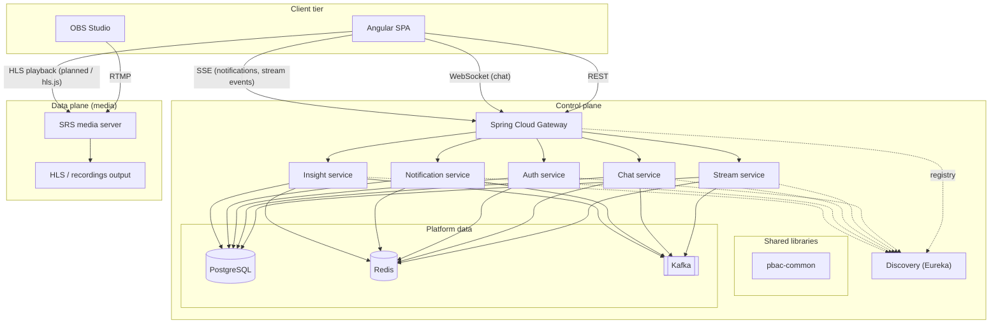
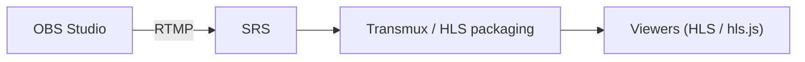

# Live Streaming Platform — Architecture Overview

**Document purpose.** This overview describes the high-level architecture of the POC for stakeholders who need a clear picture of components, boundaries, and how the system scales, without committing to implementation minutiae.

---

## 1. What this POC demonstrates

This project shows a **dual-plane** streaming platform optimized for learning and incremental delivery:

- **Data plane.** Real-time media ingestion, packaging, and delivery (OBS → media server → HLS-capable playback).
- **Control plane.** Product features: identities, stream metadata lifecycle, chat, notifications, orchestration signals, backed by synchronous APIs plus **event-driven** integration (**Kafka**) and shared state (**Redis**, **PostgreSQL**). Real-time delivery uses **WebSocket** (chat) and **SSE** (notifications, stream lifecycle events).

Infrastructure is runnable locally (**Docker Compose**) so a single developer can validate end-to-end behavior before evolving toward production posture.

Control-plane services are built as a **Gradle** multi-project under `main/source/backend/`, using **Java 21 toolchains provisioned as GraalVM Community** (ideal for running the same JVM on laptops and in the discovery Docker image). **Graal Native Image** (`nativeCompile`) is intentionally not wired: Spring Cloud Netflix (Eureka) still trips Spring Boot **AOT** for this stack; revisit when your dependencies publish complete native support or you replace discovery with a Graal-friendly registry.

---

## 2. System context (two planes)

**Takeaway for the client.** Business logic and media delivery are **separated**: the browser talks to your **API gateway** for product features (REST, WebSocket, SSE), while **live video** is delivered from the **media path** (SRS / HLS) without forcing all video bytes through Spring.

---

## 3. Control plane — components and roles

| Component | Role |
|-----------|------|
| **Angular (PrimeNG)** | Operator and viewer UI; calls APIs through the gateway (dev proxy in local runs). Uses **WebSocket** for real-time chat (primary path, REST fallback), **SSE** for notifications and stream lifecycle events, and **REST** for everything else. |
| **API Gateway** | Single entry point for all client protocols — **REST**, **WebSocket** (upgrade pass-through), and **SSE** (long-lived HTTP). **CORS** at the edge; routes to backends. With **discovery**, routes use logical service names (**`lb://…`**) so the gateway behaves as a **client-side load balancer** across instances. Long-lived connections (WS, SSE) use per-route **`response-timeout: -1`** to prevent the global 10s timeout from killing idle connections. |
| **Discovery (Eureka)** | **Service registry**: instances register on startup; the gateway resolves healthy targets for scaling out across hosts. |
| **Auth service** | Identity and authorization boundary. **PBAC + JWT** (HS256) with refresh tokens persisted in **Redis**, login **rate limiting**, audit logging, and public username/handle support. See [`docs/PBAC-AUTHORIZATION.md`](PBAC-AUTHORIZATION.md). |
| **Stream service** | Stream keys, lifecycle state machine, metadata orchestration. Publishes domain events to **Kafka** via the **outbox pattern** (`OutboxPoller` with `FOR UPDATE SKIP LOCKED`). SRS **webhook** receiver for `on_publish`/`on_unpublish` with shared-secret validation. Persistence via **PostgreSQL** (R2DBC). |
| **Chat service** | Room-style real-time messaging via **full-duplex WebSocket** (primary path) with **REST fallback**. Messages are durably stored in **PostgreSQL** and fanned out across instances via **Redis Pub/Sub** (`chat:room:{roomKey}:messages`). Read path uses **Redis ZSET cache-aside** with PostgreSQL cold-path fallback. Includes **PBAC** authorization, moderation (ban/mute), and message idempotency via client-generated IDs. |
| **Notification service** | Platform notification hub. Consumes **Kafka** domain events (stream lifecycle, moderation actions), persists notifications to **PostgreSQL**, and delivers via **REST** (bell list) and **SSE** (real-time push). Uses the **outbox pattern** (`notification_outbox`) for multi-channel delivery (in-app, future email/push). Kafka dedup via **Redis SETNX**. |
| **pbac-common** | Shared library extracted from cross-service PBAC duplication. Provides `@Entitled` annotation, `AuthorizationService`, and PBAC grammar used by auth, stream, chat, and gateway services. |

| **Insight service** | Two-sub-domain bounded context: **Analytics & Engagement** (view events, trending aggregations, suggestions, stream analytics — Phase A ✅) and **AI / LLM** (moderation classification, chat summarization, semantic search, RAG with pgvector — planned). Consumes `stream.view` Kafka topic; exposes REST endpoints via gateway. ADRs [0000](adr/insight/0000-architecture-foundation.md)–[0004](adr/insight/0004-capability-ladder.md). |

**Supporting infrastructure (Compose).**

| System | Typical use in this design |
|--------|----------------------------|
| **PostgreSQL** | Durable metadata — users, streams, chat messages, notifications, outbox tables, analytics data. Every service owns its own schema. |
| **Redis** | Low-latency caching (chat ZSET), Pub/Sub fan-out (chat messages), ephemeral state (refresh tokens, rate-limit counters, Kafka dedup), SSE connection registry. |
| **Kafka** | Decouple producers (stream lifecycle outbox, notification outbox) from consumers (notification handlers, chat room lifecycle, future analytics). |
| **Eureka** | Dynamic routing when services move to additional servers without hardcoding IPs in the gateway. |

---

## 4. Data plane — media path

- **SRS** handles publisher ingest and HTTP delivery of packaged media (HLS configuration is part of the POC baseline).
- **FFmpeg** can sit in the pipeline for transcoding or offline processing as requirements harden (not mandatory for the first demo loop).

---

## 5. Representative flows (POC narrative)

### 5.1 Streamer (control + media)

1. User signs in via the SPA; **auth** establishes session or token (to be hardened for production).
2. Authorized streamer requests a **stream key** from **stream service**; metadata is stored and an event is published to **Kafka** via the outbox (chat room creation, "live" listing, notifications).
3. Streamer configures **OBS** with the **SRS RTMP endpoint** and stream key.
4. **SRS** calls a **webhook** on **stream service** to validate the key before accepting publish.
5. On stream end, **stream service** records archive metadata (duration, size, identifiers) for VOD or catalog features.

### 5.2 Viewer (media + chat + notifications)

1. Viewer opens a **room** in the SPA; **live playback** uses the **SRS / HLS URL** (direct to media tier, not through Spring for video bytes).
2. **Chat** connects via **WebSocket** through the gateway to **chat service** (primary path). Messages are persisted to PostgreSQL, cached in Redis ZSET, and fanned out to all viewers via Redis Pub/Sub. On WebSocket failure, the client falls back to REST polling + REST POST.
3. **Notifications** (stream started, moderation actions) arrive via **SSE** through the gateway from **notification service**. The bell list is available via REST.

---

## 6. Scaling and deployment posture (what to tell your client)

- **Stateless API instances** (`auth`, `stream`, `notification`, `gateway`) can run **multiple replicas** behind discovery: each replica registers as the same **`spring.application.name`** with a distinct **`instance-id`** (host + port).
- **Soft-stateful services** (`chat`): chat-service holds per-instance WebSocket session references (in-memory `RoomPubSubService` registry). This state is **soft** — lost on restart, recreated as clients reconnect, with zero data durability implications. Redis Pub/Sub fans messages across all instances, so clients can reconnect to any instance without sticky sessions.
- **Gateways** typically scale horizontally with an **external** load balancer (cloud LB / reverse proxy); Eureka is primarily for **backend** resolution, not for browser-facing gateway VIPs unless you deliberately design it that way.
- **Stateful concerns** remain in **PostgreSQL**, **Redis**, and **Kafka** (operational tooling: backups, HA, partitioning). SRS may be clustered or placed behind CDN as requirements grow.

This POC intentionally keeps **Compose** for dependencies and **runs Spring apps locally** while still illustrating how the same codebase moves to separate servers via **discovery** and **`EUREKA_SERVER_URL`**.

---

## 7. Security and POC boundaries (explicit)

For a credible client conversation, distinguish **demo** vs **production**:

| Area | POC baseline | Typical hardening later |
|------|----------------|---------------------------|
| Auth | PBAC + JWT (HS256), refresh tokens in Redis, login rate limiting, audit logging | JWT/OIDC, MFA, audited sessions |
| Eureka / admin | Often open by default | Auth, TLS, private network |
| Kafka / Redis / Postgres | Local credentials | Secrets management, TLS, ACLs |
| Media keys | Generated keys | Short TTL, revocation, SRS hook enforcement |
| API surface | Gateway + PBAC on auth/stream/chat services; sliding-window rate limiting | Consistent OAuth2/resource server, per-route rate limits |
| WebSocket | JWT via query parameter, PBAC check at connect | Token rotation, connection-level rate limiting |

---

## 8. Suggested demo script (5–10 minutes)

1. Start **infra** (Compose): Postgres, Redis, Kafka, SRS, Eureka.
2. Start **microservices**, then **gateway**, then **Angular**.
3. Show **Eureka dashboard**: registered instances and multiple replicas if spun up.
4. Hit SPA **health** panel or **gateway** routes to prove routing through discovery.
5. (Optional) Show **OBS** publishing to SRS and playback URL in browser.

---

## 9. Glossary

| Term | Meaning here |
|------|----------------|
| **Control plane** | APIs, orchestration, metadata, messaging — not the raw media bytes path. |
| **Data plane** | Live media ingest, transcoding/HLS packaging, delivery. |
| **Gateway** | API edge; terminates browser traffic (REST, WebSocket upgrade, SSE) and forwards to internal services. |
| **Discovery** | Service registry (Eureka); enables **`lb://`** routing across instances. |
| **Kafka topic** | Durable append log for asynchronous domain events between services. |
| **WebSocket** | Full-duplex persistent TCP connection; used by chat service for real-time messaging (send + receive). Browser connects through gateway (upgrade pass-through). |
| **SSE** | Server-Sent Events — unidirectional HTTP long-lived connection for server→client push. Used by notification service (real-time push) and stream service (lifecycle events). Browser `EventSource` API provides built-in auto-reconnect. |
| **Outbox Pattern** | Transactional write to an `_outbox` table in the same DB transaction as the domain entity, then an async poller publishes to Kafka. Guarantees at-least-once event publication without distributed transactions. Used by stream service and notification service. |
| **PBAC** | Policy-Based Access Control — authorization driven by policy rules evaluated against entitlements in JWT claims, not hardcoded role checks. The `pbac-common` shared library provides the grammar and annotation model. |

---

*Generated to support POC and stakeholder reviews; align SLA, HA, and security targets with client requirements before any production commitment.*
