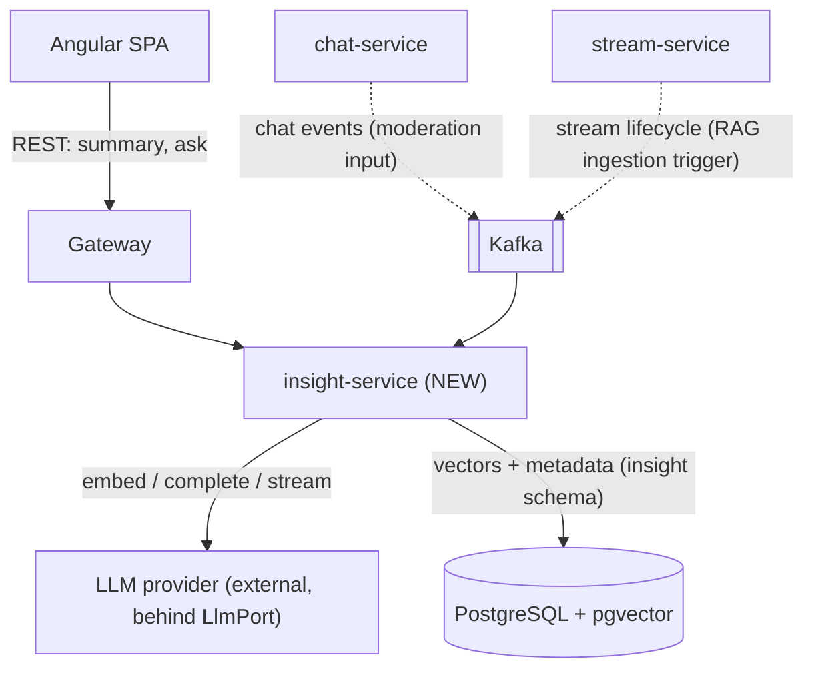

# Insight Service — Design Sketch (Phase 7, not yet built)

> **Status: rough sketch, deferred to [Phase 7](IMPLEMENTATION-PLAN.md#phase-7--ai--llm-layer-insight-service-).**
> Nothing here is implemented. This document captures the *shape* of the future
> `insight-service` — module layout, ports, data flow, and per-rung deltas — so the
> eventual build starts from an agreed structure. Code blocks are **illustrative
> pseudocode, not compilable Java**. Decisions live in
> [docs/adr/insight/](adr/insight/); this is the picture that ties them together.

## Why this exists now

We deliberately deferred *implementation* to the final phase but wrote the *scaffolding*
(ADRs + this sketch) early, while the design context is fresh. The goal is to make the
future real build faster and more consistent — not to add complexity to the current
phases. See [ADR-0004](adr/insight/0004-capability-ladder.md) for the rationale and the
delivery order.

## The one-paragraph summary

`insight-service` is a new control-plane service that adds LLM-powered features:
summarization, classification (moderation), semantic search, and retrieval-augmented
Q&A. It is built in **four rungs** — plain LLM call → classification → embeddings →
full RAG — each independently shippable ([ADR-0004](adr/insight/0004-capability-ladder.md)).
The LLM provider and the vector store are both **hexagonal ports** so they stay
swappable ([ADR-0002](adr/insight/0002-llm-provider-port.md)). Vectors live in
**pgvector on the existing PostgreSQL**, not a new datastore
([ADR-0003](adr/insight/0003-pgvector-over-dedicated-vector-db.md)).

---

## Where it sits (system context)



- **Synchronous edge (REST via gateway):** on-demand features — "catch me up" summary, "ask this stream".
- **Asynchronous edge (Kafka consumer):** moderation (consume chat events) and RAG ingestion (consume stream lifecycle → transcribe → chunk → embed → store). Keeps expensive work off the request path — mirrors notification-service.
- **Two swappable edges:** `LlmPort` and `VectorStorePort`.

---

## Module layout (matches stream/chat convention)

Layered-reactive with hexagonal ports at the two swappable edges
([ADR-0001](adr/insight/0001-insight-service-architecture.md)):

```
insight-service/src/main/java/com/streaming/insight/
├── api/                      # REST edge (gateway-facing)
│   ├── InsightController.java        # POST /v1/summaries, POST /v1/ask (rung 1 / rung 4)
│   └── dto/                          # request/response records
├── application/              # orchestration + cross-cutting (timeout/retry/fallback/cost)
│   ├── SummaryService.java           # rung 1
│   ├── ModerationService.java        # rung 2
│   ├── SearchService.java            # rung 3 (retrieval only)
│   └── RagService.java               # rung 4 (retrieval + generation)
├── domain/                   # ports + domain types (no framework/vendor types)
│   ├── port/
│   │   ├── LlmPort.java              # complete / stream / structured
│   │   ├── EmbeddingPort.java        # text -> vector   (rung 3+)
│   │   └── VectorStorePort.java      # upsert / similaritySearch (rung 3+)
│   └── model/                        # Prompt, Chunk, Citation, ...
├── infrastructure/           # adapters selected by config
│   ├── llm/                          # provider adapter(s) behind LlmPort
│   ├── vector/                       # pgvector adapter behind VectorStorePort
│   ├── messaging/                    # Kafka consumers (moderation, ingestion)
│   └── persistence/                  # insight schema (R2DBC + pgvector)
└── config/
    ├── SecurityConfig.java           # JWT (from pbac-common once extracted)
    └── InsightProperties.java        # provider, model, TTLs, cost caps
```

**Flyway:** `V1__bootstrap_insight_schema.sql` — `CREATE SCHEMA insight` + enable
`vector` extension + tables (`document_chunk` with a `vector` column, `embedding_meta`).
Added when **rung 3** starts, not before.

---

## Port sketches (illustrative — NOT compilable)

Vendor-neutral by design ([ADR-0002](adr/insight/0002-llm-provider-port.md)). Exact
signatures finalized at implementation.

```java
// domain/port/LlmPort.java  — pseudocode
interface LlmPort {
    Mono<String>  complete(Prompt prompt);              // rung 1: single-shot
    Flux<String>  stream(Prompt prompt);                // rung 1: token streaming -> SSE
    <T> Mono<T>   structured(Prompt prompt, Class<T> schema);  // rung 1-2: JSON/tags/labels
}

// domain/port/EmbeddingPort.java  — pseudocode (rung 3+)
interface EmbeddingPort {
    Mono<float[]> embed(String text);
}

// domain/port/VectorStorePort.java  — pseudocode (rung 3+)
interface VectorStorePort {
    Mono<Void>        upsert(String id, float[] vector, ChunkMeta meta);
    Flux<ScoredChunk> similaritySearch(float[] query, int topK, Filter filter);
}
```

Cross-cutting concerns (timeout, retry+backoff, fallback response, token/cost
accounting) wrap the port **in the application layer**, so they apply to every adapter
uniformly. This is the "LLM is an unreliable dependency" principle made structural.

---

## Data flows per rung

### Rung 1 — Plain call: "catch me up" chat summary (streaming)
```
Browser → GW → InsightController.summarize(roomKey)
  → SummaryService: fetch recent messages (from chat-service API or read model)
  → LlmPort.stream(prompt)               // Flux<String> tokens
  → SSE back to browser                  // WebFlux end-to-end streaming
Fallback: provider down/slow → return cached last summary or graceful "unavailable"
```

### Rung 2 — Classification: chat moderation (async, off hot path)
```
chat message produced → Kafka (chat events topic)
  → ModerationService (Kafka consumer)
  → LlmPort.structured(prompt, ModerationVerdict)   // {toxic, spam, score}
  → on positive: emit moderation event / flag        // never blocks message delivery
Fallback: provider down → messages still deliver; moderation is best-effort, batched
```

### Rung 3 — Embeddings: semantic VOD search (retrieval only, no generation)
```
INGEST (async):  stream ended → (ASR transcript*) → chunk → EmbeddingPort.embed
                 → VectorStorePort.upsert (pgvector, insight schema)
QUERY (sync):    Browser → GW → SearchService
                 → EmbeddingPort.embed(query) → VectorStorePort.similaritySearch(topK)
                 → return ranked results (measurable recall — no LLM in the loop)
* ASR/transcripts are a prerequisite tracked outside this ladder (media pipeline).
```

### Rung 4 — Full RAG: "ask this stream" (retrieval + grounded generation)
```
Browser → GW → RagService.ask(streamId, question)
  → EmbeddingPort.embed(question) → VectorStorePort.similaritySearch(topK, filter=streamId)
  → build grounded prompt with retrieved chunks + timestamps
  → LlmPort.stream(prompt) → SSE answer with citations ("jump to 14:32")
```
Rung 4 = rung 3's retrieval + a generation step. Everything else is already built and
understood — which is the entire point of the ladder ordering.

---

## Deliberately open (decide at Phase 7 start)

These are intentionally **not** decided now, to reflect the landscape at build time:

- **Which LLM provider / model** (hosted vs. local; per-rung model choice) → follow-up ADR.
- **Which embedding model / vector dimension** → decided with the pgvector schema at rung 3.
- **ASR / transcript pipeline** (prerequisite for rungs 3–4) → separate design, media-plane-owned.
- **Cost ceilings and rate limits** per feature → set when the first billed feature ships.

---

## Related

- [ADR-0004 — Capability ladder](adr/insight/0004-capability-ladder.md) *(read first)*
- [ADR-0001 — Standalone hexagonal service](adr/insight/0001-insight-service-architecture.md)
- [ADR-0002 — LLM provider port](adr/insight/0002-llm-provider-port.md)
- [ADR-0003 — pgvector over dedicated vector DB](adr/insight/0003-pgvector-over-dedicated-vector-db.md)
- [SERVICE-ARCHITECTURE.md](SERVICE-ARCHITECTURE.md) — per-service style guidance
- [ARCHITECTURE.md](ARCHITECTURE.md) — dual-plane system overview
