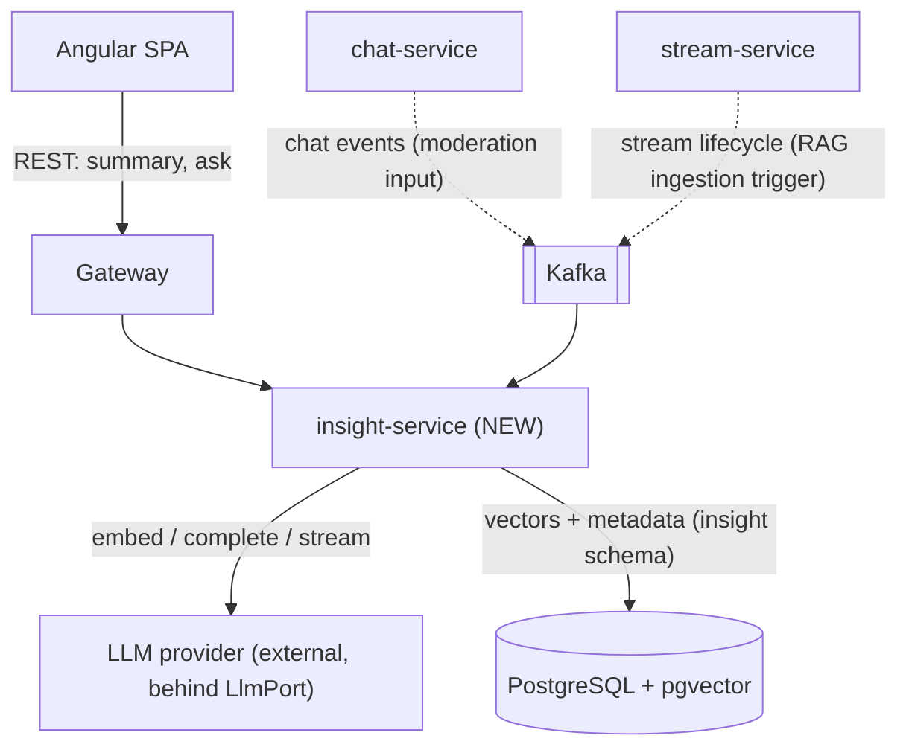

# Insight Service — Design Sketch (Phase 7, in progress)

> **Status: Phase A (analytics) shipped 2026-08-08. AI/LLM rungs 1-4 remain planned.**
> The Gradle module is scaffolded and the analytics sub-domain (event capture →
> aggregate → serve) is live. The AI/LLM sub-domain (rungs 1-4) is still a sketch —
> code blocks for those sections are **illustrative pseudocode, not compilable Java**.
> Decisions live in [docs/adr/insight/](adr/insight/); this is the picture that ties them together.

## Why this exists now

Phase A (analytics) shipped in 2026-08-08 — the Gradle module is scaffolded and the
event-driven analytics pipeline is live. The AI/LLM sub-domain (rungs 1-4) remains
planned — the ADRs + this sketch were written early so the eventual build starts from
an agreed structure. See [ADR-0004](adr/insight/0004-capability-ladder.md) for the
rationale and delivery order.

## The one-paragraph summary

`insight-service` is a control-plane service with **two sub-domains**: **(A) Analytics &
Engagement** — capture viewer events via Kafka, compute trending suggestions and
streamer analytics from aggregated engagement data (shipped). **(B) AI / LLM** —
summarization, classification (moderation), semantic search, and retrieval-augmented
Q&A, built in **four rungs** — plain LLM call → classification → embeddings →
full RAG — each independently shippable ([ADR-0004](adr/insight/0004-capability-ladder.md)).
The LLM provider and the vector store are both **hexagonal ports** so they stay
swappable ([ADR-0002](adr/insight/0002-llm-provider-port.md)). Vectors live in
**pgvector on the existing PostgreSQL**, not a new datastore
([ADR-0003](adr/insight/0003-pgvector-over-dedicated-vector-db.md)).

---

## Where it sits (system context)



- **Synchronous edge (REST via gateway):** on-demand features — "catch me up" summary, "ask this stream".
- **Asynchronous edge (Kafka consumer):** moderation (consume chat events) and RAG ingestion (consume stream lifecycle → transcribe → chunk → embed → store). Keeps expensive work off the request path — mirrors notification-service.
- **Two swappable edges:** `LlmPort` and `VectorStorePort`.

---

## Module layout (matches stream/chat convention)

Layered-reactive with hexagonal ports at the two swappable edges
([ADR-0001](adr/insight/0001-insight-service-architecture.md)):

```
insight-service/src/main/java/com/streaming/insight/
├── api/                      # REST edge (gateway-facing)
│   ├── InsightController.java        # POST /v1/summaries, POST /v1/ask (rung 1 / rung 4)
│   └── dto/                          # request/response records
├── application/              # orchestration + cross-cutting (timeout/retry/fallback/cost)
│   ├── SummaryService.java           # rung 1
│   ├── ModerationService.java        # rung 2
│   ├── SearchService.java            # rung 3 (retrieval only)
│   └── RagService.java               # rung 4 (retrieval + generation)
├── domain/                   # ports + domain types (no framework/vendor types)
│   ├── port/
│   │   ├── LlmPort.java              # complete / stream / structured
│   │   ├── EmbeddingPort.java        # text -> vector   (rung 3+)
│   │   └── VectorStorePort.java      # upsert / similaritySearch (rung 3+)
│   └── model/                        # Prompt, Chunk, Citation, ...
├── infrastructure/           # adapters selected by config
│   ├── llm/                          # provider adapter(s) behind LlmPort
│   ├── vector/                       # pgvector adapter behind VectorStorePort
│   ├── messaging/                    # Kafka consumers (moderation, ingestion)
│   └── persistence/                  # insight schema (R2DBC + pgvector)
└── config/
    ├── SecurityConfig.java           # JWT (from pbac-common once extracted)
    └── InsightProperties.java        # provider, model, TTLs, cost caps
```

**Flyway:** `V1__bootstrap_insight_schema.sql` — `CREATE SCHEMA insight` + enable
`vector` extension + tables (`document_chunk` with a `vector` column, `embedding_meta`).
Added when **rung 3** starts, not before.

---

## Port sketches (illustrative — NOT compilable)

Vendor-neutral by design ([ADR-0002](adr/insight/0002-llm-provider-port.md)). Exact
signatures finalized at implementation.

```java
// domain/port/LlmPort.java  — pseudocode
interface LlmPort {
    Mono<String>  complete(Prompt prompt);              // rung 1: single-shot
    Flux<String>  stream(Prompt prompt);                // rung 1: token streaming -> SSE
    <T> Mono<T>   structured(Prompt prompt, Class<T> schema);  // rung 1-2: JSON/tags/labels
}

// domain/port/EmbeddingPort.java  — pseudocode (rung 3+)
interface EmbeddingPort {
    Mono<float[]> embed(String text);
}

// domain/port/VectorStorePort.java  — pseudocode (rung 3+)
interface VectorStorePort {
    Mono<Void>        upsert(String id, float[] vector, ChunkMeta meta);
    Flux<ScoredChunk> similaritySearch(float[] query, int topK, Filter filter);
}
```

Cross-cutting concerns (timeout, retry+backoff, fallback response, token/cost
accounting) wrap the port **in the application layer**, so they apply to every adapter
uniformly. This is the "LLM is an unreliable dependency" principle made structural.

---

## Data flows per rung

### Rung 1 — Plain call: "catch me up" chat summary (streaming)
```
Browser → GW → InsightController.summarize(roomKey)
  → SummaryService: fetch recent messages (from chat-service API or read model)
  → LlmPort.stream(prompt)               // Flux<String> tokens
  → SSE back to browser                  // WebFlux end-to-end streaming
Fallback: provider down/slow → return cached last summary or graceful "unavailable"
```

### Rung 2 — Classification: chat moderation (async, off hot path)
```
chat message produced → Kafka (chat events topic)
  → ModerationService (Kafka consumer)
  → LlmPort.structured(prompt, ModerationVerdict)   // {toxic, spam, score}
  → on positive: emit moderation event / flag        // never blocks message delivery
Fallback: provider down → messages still deliver; moderation is best-effort, batched
```

### Rung 3 — Embeddings: semantic VOD search (retrieval only, no generation)
```
INGEST (async):  stream ended → (ASR transcript*) → chunk → EmbeddingPort.embed
                 → VectorStorePort.upsert (pgvector, insight schema)
QUERY (sync):    Browser → GW → SearchService
                 → EmbeddingPort.embed(query) → VectorStorePort.similaritySearch(topK)
                 → return ranked results (measurable recall — no LLM in the loop)
* ASR/transcripts are a prerequisite tracked outside this ladder (media pipeline).
```

### Rung 4 — Full RAG: "ask this stream" (retrieval + grounded generation)
```
Browser → GW → RagService.ask(streamId, question)
  → EmbeddingPort.embed(question) → VectorStorePort.similaritySearch(topK, filter=streamId)
  → build grounded prompt with retrieved chunks + timestamps
  → LlmPort.stream(prompt) → SSE answer with citations ("jump to 14:32")
```
Rung 4 = rung 3's retrieval + a generation step. Everything else is already built and
understood — which is the entire point of the ladder ordering.

---

---

## Phase A — Analytics & Engagement (shipped 2026-08-08)

The analytics sub-domain is the data foundation for all future AI/LLM features. It
teaches the event-driven pipeline end-to-end before any LLM complexity enters.

### What was built (20 new files, 7 modified across 4 modules)

```
insight-service/src/main/java/com/streaming/insight/
├── api/
│   ├── SuggestionController.java        # GET /v1/suggestions
│   ├── AnalyticsController.java         # GET /v1/analytics/streams/{streamId}
│   └── dto/
│       ├── SuggestionResponse.java
│       └── StreamAnalyticsResponse.java
├── application/
│   ├── EngagementService.java           # Entity conversion + repository.save()
│   ├── SuggestionService.java           # Trending channels/categories (configurable window)
│   └── AnalyticsService.java            # Stream stats: views, unique viewers, peak hour
├── domain/model/
│   ├── EngagementEventEntity.java       # Persistable<UUID>, static create() factory
│   ├── ChannelSuggestion.java
│   ├── CategorySuggestion.java
│   └── StreamAnalytics.java
├── infrastructure/
│   ├── messaging/
│   │   └── EngagementEventListener.java # @KafkaListener, Redis SETNX dedup (24h)
│   └── persistence/
│       └── EngagementEventRepository.java  # 4 @Query methods, nested projection records
└── config/
    ├── SecurityConfig.java              # JWT + Structured401AuthenticationEntryPoint
    ├── InsightProperties.java           # @ConfigurationProperties("insight")
    └── R2dbcConfig.java                 # TransactionalOperator only (all Tier 1 types)

common/src/main/java/.../messaging/
└── EngagementEvent.java                 # Immutable record, viewed() factory

stream-service/src/main/java/.../service/
└── ViewEventProducer.java               # Fire-and-forget KafkaTemplate.send()
```

### Schema (`insight.engagement_event`)

```sql
CREATE TABLE insight.engagement_event (
    id             UUID PRIMARY KEY DEFAULT gen_random_uuid(),
    event_id       VARCHAR(64) NOT NULL,       -- Kafka event ID (dedup)
    event_type     VARCHAR(32) NOT NULL,        -- "VIEW" (Phase A), LIKE/SUBSCRIBE (Phase B)
    stream_id      UUID NOT NULL,
    actor_subject  VARCHAR(128) NOT NULL,       -- JWT sub of the viewer
    target_type    VARCHAR(32) NOT NULL DEFAULT 'CHANNEL',
    target_id      VARCHAR(128) NOT NULL,       -- broadcaster_username or category name
    category       VARCHAR(128),
    occurred_at    TIMESTAMPTZ NOT NULL DEFAULT now()
);
-- 4 indexes: target+time, actor+time, stream+time, UNIQUE(event_id)
```

All columns are Tier 1 types — no JSONB, arrays, or custom ENUMs. No R2DBC converters needed.

### Data flow

```
Browser → GET /streams/{id}
  → stream-service.getStream()
    → trackViewEvent (Redis per-user dedup, existing)
    → viewEventProducer.sendViewEvent()    # Kafka: fire-and-forget
  → Kafka topic stream.view
    → insight-service.EngagementEventListener
      → JSON deserialize → EngagementEvent
      → Redis SETNX dedup (24h TTL)
      → EngagementService.persistView()
        → EngagementEventEntity.create()
        → repository.save()
          → INSERT INTO insight.engagement_event

GET /api/insights/v1/suggestions
  → SuggestionService: findTrendingChannels(windowHours, limit)
  → SuggestionService: findTrendingCategories(windowHours, limit)
  → SuggestionResponse { channels, categories }

GET /api/insights/v1/analytics/streams/{streamId}
  → AnalyticsService: findStreamViewStats + findHourlyDistribution
  → StreamAnalyticsResponse { totalViews, uniqueViewers, peakHour, hourlyDistribution }
```

### Key design decisions

| Decision | Rationale |
|----------|-----------|
| Fire-and-forget producer (no outbox) | Views are telemetry, not transactions — a missed event loses one data point; a blocked REST call loses a user action |
| `EngagementEvent` in `common` module | Both stream-service (producer) and insight-service (consumer) share the contract — mirrors `StreamEvent` pattern |
| Redis SETNX + UNIQUE index dual dedup | Redis prevents INSERT attempt; UNIQUE(event_id) is defense-in-depth |
| UUID internal PK + VARCHAR event_id | Internal PK independent of external event identifier format |

### REST API contracts

```
GET /v1/suggestions
→ 200 { channels: [{ channelUsername, viewCount, score }],
        categories: [{ category, viewCount, score }] }

GET /v1/analytics/streams/{streamId}
→ 200 { streamId, totalViews, uniqueViewers, peakHour, category,
        hourlyDistribution: { "14": 25, "15": 30, "20": 45 } }
→ 404 if no data
```

### Deferred to Phase B

- LIKE / SUBSCRIBE event types (requires channel-service)
- Personalized suggestions (requires LIKE/SUBSCRIBE data)
- Stream time suggestions ("best time to stream")
- Consumer-side dedup window (1 VIEW per user-channel per hour)
- Notification integration

---

## Deliberately open (decide at Phase 7 start)

These are intentionally **not** decided now, to reflect the landscape at build time:

- **Which LLM provider / model** (hosted vs. local; per-rung model choice) → follow-up ADR.
- **Which embedding model / vector dimension** → decided with the pgvector schema at rung 3.
- **ASR / transcript pipeline** (prerequisite for rungs 3–4) → separate design, media-plane-owned.
- **Cost ceilings and rate limits** per feature → set when the first billed feature ships.

---

## Related

- [Phase A Blueprint](plans/insight-service-phase-a-blueprint.md) — original implementation plan (21 tasks)
- [Phase A Retrospective](plans/insight-service-phase-a-retrospective.md) — what shipped, deferrals, gaps
- [ADR-0000 — Architecture foundation](adr/insight/0000-architecture-foundation.md) — analytics + AI/LLM bounded contexts
- [ADR-0001 — Standalone hexagonal service](adr/insight/0001-insight-service-architecture.md)
- [ADR-0002 — LLM provider port](adr/insight/0002-llm-provider-port.md)
- [ADR-0003 — pgvector over dedicated vector DB](adr/insight/0003-pgvector-over-dedicated-vector-db.md)
- [ADR-0004 — Capability ladder](adr/insight/0004-capability-ladder.md) *(read first)*
- [IMPLEMENTATION-PLAN.md](IMPLEMENTATION-PLAN.md) — master plan, Phase 7
- [SERVICE-ARCHITECTURE.md](SERVICE-ARCHITECTURE.md) — per-service style guidance
- [ARCHITECTURE.md](ARCHITECTURE.md) — dual-plane system overview
