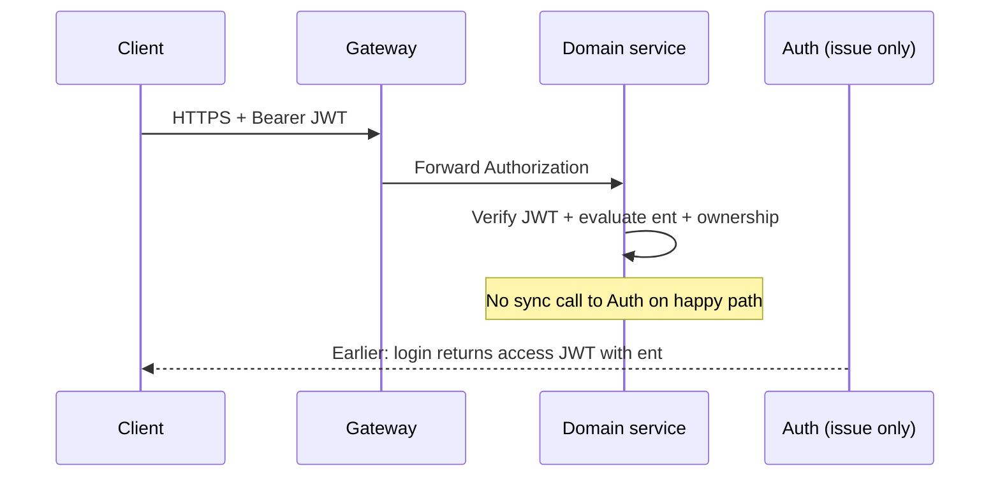

# Policy-Based Authorization (PBAC) — Domain Model & JWT Design

This document defines a **policy-based authorization** model aligned with your control-plane modules (**auth**, **stream**, **chat**, **notification**, **gateway**), plus a **JWT payload** shape that carries enough **authorization facts** for each service to validate requests without synchronous calls back to Auth on every hit (subject to revocation trade-offs in §9).

---

## 1. Design goals

| Goal | Approach |
|------|----------|
| **Consistent language** across services | Shared **resource types** + **actions** naming (catalog below). |
| **PBAC over raw RBAC** | Bind **named policies** to subjects/groups/context; policies reference resource patterns + actions + optional **constraints** (ABAC-lite: owner, room, tier). |
| **Decentralized enforcement** | Each service verifies **JWT signature** + evaluates **claims** against local policy rules for its API surface. |
| **Bounded JWT size** | Prefer **normalized entitlement strings** or **policy version + policy set hash** + optional mini-cache—not full Rego blobs in JWT. |

**PBAC (here)** means: authorization decisions use **explicit policy rules** (“who may do **action** on **resource** under **conditions**”), not only a flat role string. Roles may still exist as **groupings that attach policies**.

---

## 2. Canonical resource types & identifiers

Use a stable **`resource`** string pattern in JWT and logs:

Format: **`{domain}:{kind}:{scope}`**  
Optionally tighten scope: **`{domain}:{kind}:{scope}:{instanceId}`** for instance-bound checks performed in services.

| Domain | Kind | Typical scope / instance | Used by |
|--------|------|---------------------------|---------|
| `identity` | `user` | `self`, `{userSubject}` | auth |
| `identity` | `credential` | `self` | auth |
| `stream` | `session` | `*` or `{sessionId}` | stream |
| `stream` | `publish-key` | `*` or `{sessionId}` | stream, SRS webhook |
| `stream` | `archive` | `*` or `{archiveId}` | stream (future) |
| `media` | `playback` | `room:{externalKey}` or `session:{sessionId}` | gateway/SRS coordination (often public read with rate limits) |
| `chat` | `room` | `*` or `{roomId \| external_key}` | chat |
| `chat` | `message` | `room:{externalKey}` or `{messageId}` | chat |
| `chat` | `moderation` | `room:{externalKey}` | chat |
| `notification` | `subscription` | `self`, `{subscriberSubject}` | notification |
| `notification` | `outbox` | `*` (admin/integration) | notification |
| `platform` | `admin` | `*` | future ops |

**Subject identifiers:** Reuse **`sub`** (JWT) consistently with `broadcaster_subject` / `author_subject` / `subscriber_subject` you already carry as opaque strings (UUID/username issued by Auth).

---

## 3. Action catalog (verbs)

Normalize HTTP + domain actions to these **verbs** (extend over time via policy schema `ver`):

| Verb | Typical meaning |
|------|----------------|
| **create** | Create new aggregate (session, room, subscription, …). |
| **read** | Read metadata or listings (non-sensitive). |
| **read_sensitive** | PII/export-grade reads (narrow use). |
| **update** | Mutate mutable fields. |
| **delete** | Hard/soft delete. |
| **issue_key** | Create/rotate publish credentials for a stream session. |
| **validate_publish** | SRS / internal webhook: validate ingest key/session (trusted caller + policy). |
| **lifecycle** | Start/end stream lifecycle transitions (beyond generic update). |
| **send** | Post chat message in a room. |
| **read_history** | Read durable/historical messages (beyond hot cache TTL). |
| **moderate** | Ban/mute/delete others’ messages, close room features. |
| **subscribe_topics** | Register notification interest (Kafka topic patterns / logical channels). |
| **manage_outbox** | Operator/integration manages notification outbox rows. |
| **impersonate** | Admin-only breakout (dangerous — separate token class). |

**HTTP mapping:** Each route maps to `(resource, action)` in the owning service (see §6).

---

## 4. Policy model (logical)

### 4.1 Policy rule (conceptual)

Each **policy** is a set of **statements**:

- **Effect:** `allow` | `deny` (deny wins if you implement explicit deny).
- **Subjects:** match `sub`, group/role, or attribute (e.g. `claim.tier = PRO`).
- **Resources:** pattern match on §2 strings (e.g. `stream:session:*`).
- **Actions:** subset of §3.
- **Conditions (optional):** `resource.owner == subject.sub`, `time window`, `ip allowlist` (usually edge), `mfa_done`.

### 4.2 Named policies (examples)

| Policy id | Intent |
|-----------|--------|
| `policy.viewer.base` | read playback metadata, read public chat, read notification self. |
| `policy.streamer.live` | create/update own `stream:session`, `issue_key`, `lifecycle` on **own** sessions; `send` in linked chat rooms. |
| `policy.moderator.chat` | `moderate` on assigned rooms (or `*` for staff). |
| `policy.service.srs-webhook` | **service account only:** `validate_publish` on `stream:publish-key` with mTLS / separate `aud`. |
| `policy.admin.platform` | wide `platform:admin:*` (split fine-grained later). |

Store policy definitions in **auth** (or **policy service** later). JWT carries **materialized entitlements** for the current session (§5), not the full policy document.

---

## 5. JWT payload for PBAC

### 5.1 Standard claims (required)

- **`iss`**, **`aud`** (e.g. `streaming-control-plane`), **`sub`**, **`exp`**, **`iat`**, **`jti`**
- Optional: **`nbf`**, **`typ`** (`at+jwt` for access tokens)

### 5.2 PBAC claims (recommended shape)

```json
{
  "iss": "https://auth.example",
  "aud": "streaming-control-plane",
  "sub": "usr_01hxy...",
  "exp": 1735689600,
  "iat": 1735686000,
  "jti": "01hxy...",

  "ver": 1,
  "pv": "2026-02-01T00:00:00Z",

  "ent": [
    "allow stream:session:self create read update lifecycle issue_key",
    "allow stream:publish-key:self validate_publish",
    "allow chat:room:* read",
    "allow chat:message:room:* send",
    "allow notification:subscription:self create read update delete",
    "allow identity:user:self read update"
  ],

  "attr": {
    "roles": ["streamer", "viewer"],
    "tier": "PRO",
    "verified_streamer": true
  }
}
```

**Field meanings**

| Claim | Purpose |
|-------|---------|
| **`ver`** | Entitlement string grammar version (integer). |
| **`pv`** | **Policy version** / materialization timestamp (when entitlements were computed). Rotate when global policies change. |
| **`ent`** | **Compact allow list** (PBAC materialization). Each string: `allow <resourcePattern> <action> [<action>...]`. Use `self` where enforcement resolves instance to `sub` (see §5.3). |
| **`attr`** | Small subject attributes for **local conditions** (not full user profile). |

**Why `ent` strings vs JSON objects:** Smaller, diffable, log-friendly. Parser is trivial in each service.

**Alternative when JWT must stay tiny:**  
`ent_hash` + `pv` + Auth **introspection** or **Redis policy snapshot** (adds latency / coupling). Prefer **short `ent`** + **short TTL** (e.g. 5–15 min) + **refresh** for long sessions.

### 5.3 Resolving `self` and ownership

For resources like `stream:session:self`:

- Service loads row by id from path; checks **`row.broadcaster_subject == sub`** (or mapped internal user id).
- Deny if mismatch even if token contains `stream:session:*` unless a separate **admin** entitlement exists.

This combines **PBAC in token** with **resource-level ABAC** in the service (recommended for streaming/chat).

### 5.4 Service-to-service (SRS webhook, internal jobs)

Implemented via `POST /v1/internal/service-tokens` (HTTP Basic auth, auth-service only — not exposed through gateway).

Do **not** reuse end-user JWT for SRS. Service tokens differ from user tokens:

| Claim | User token | Service token (SRS) |
|-------|-----------|---------------------|
| `sub` | User UUID | `svc:srs-webhook` (principal subject) |
| `aud` | `streaming-control-plane` | `stream-service-internal` |
| `attr` | `{roles, tier, verified_streamer}` | absent |
| `ent` | All user policies | Only SERVICE_ACCOUNT policies |
| `exp` | 15 min (configurable) | 60 min (configurable) |

Service tokens are issued by `AccessTokenIssuanceService.issueForServiceAccount(principalSubject)`, which resolves policies attached via `principal_type = 'SERVICE_ACCOUNT'`.

Additional transport security (mTLS, IP allowlist) should be layered at the network/reverse-proxy level for production.

---

## 6. Enforcement matrix (by module / rough business logic)

> **Status:** Enforcement is currently **gateway-only** — the gateway validates JWT signature, expiry, and issuer for all routes (§6.5). Per-service `ent` parsing and ownership resolution (§6.1–6.4, §7) is designed but **not yet implemented**. Services currently trust the gateway's authentication and expose `sub` from the validated JWT to controllers. See §11 for implementation roadmap.

Map each API or future route to **`(resource, action)`**. Services reject if no **allow** matches after pattern + condition evaluation.

### 6.1 auth-service (`/api/auth`)

| Operation / flow | Resource | Action |
|------------------|----------|--------|
| Register / create account | `identity:user` | `create` (often public or invite-only) |
| Login / token issue | `identity:user` | `read` (credential check is pre-auth) |
| Change password / profile | `identity:user:self` | `update` |
| Admin user search | `identity:user:*` | `read_sensitive` (admin policy) |

### 6.2 stream-service (`/api/streams`)

| Operation / flow | Resource | Action |
|------------------|----------|--------|
| Health / public metadata | `stream:session` | `read` (if exposed) |
| Create stream session / key | `stream:session:self` | `create`, `issue_key` |
| Update session / end stream | `stream:session:{id}` | `update`, `lifecycle` (owner or admin) |
| List my sessions | `stream:session:self` | `read` |
| SRS webhook validate key | `stream:publish-key:{sessionOrKeyRef}` | `validate_publish` (**service token**) |
| Archive metadata write | `stream:archive:{id}` | `create` / `update` (owner / system) |

### 6.3 chat-service (`/api/chat`)

| Operation / flow | Resource | Action |
|------------------|----------|--------|
| Read recent / hot path | `chat:room:{key}` | `read` |
| Read historical page | `chat:message:room:{key}` | `read_history` |
| Post message | `chat:message:room:{key}` | `send` |
| Moderation actions | `chat:moderation:room:{key}` | `moderate` |
| Create room (if explicit) | `chat:room` | `create` (often bound to stream lifecycle) |

**Linking room to stream:** Enforce “only streamer or viewers of that stream can X” via **room metadata** (e.g. `external_key = streamId`) + stream-service read (sync) or **embedded claim** `attr.viewable_rooms` (can blow JWT size—prefer service lookup for fan-out).

### 6.4 notification-service (`/api/notifications`)

| Operation / flow | Resource | Action |
|------------------|----------|--------|
| Manage my subscriptions | `notification:subscription:self` | `create`, `read`, `update`, `delete` |
| Operator / integration outbox | `notification:outbox:*` | `manage_outbox` (narrow service/admin) |
| Kafka consumer | N/A (no user JWT) | workload identity + topic ACLs |

### 6.5 gateway

- **TLS termination**, **JWT validation** (optional at edge), **rate limits**, **route-level** coarse checks (e.g. require `Bearer`).  
- **Fine PBAC** remains in domain services to avoid duplicating all rules in gateway config.

---

## 7. Evaluation algorithm (each service)

1. **Authenticate:** Verify JWT crypto (`iss`, signature, `exp`, optional `aud`).  
2. **Authorize:** Parse `ver`, build **request context**: `(sub, attr, HTTP method/path, extracted ids)`.  
3. **Map route → (resource, action)** via static table §6.  
4. **Expand `ent`:** For each entitlement line `allow <pattern> <actions...>`: if pattern matches resource AND action listed → **allow**.  
5. **Apply deny + ownership:** Explicit deny wins; then **instance checks** (owner, room membership).  
6. **Audit:** Log `sub`, `jti`, `policy pv`, decision (allow/deny), resource id (redact PII).

---

## 8. Persistence (Auth schema — implemented)

All tables live under the **`auth`** schema in PostgreSQL and are managed via Flyway migrations (V1–V8).

### 8.1 Policy tables

| Table | Role | Key columns |
|-------|------|-------------|
| `policy` | Named, versioned policy documents | `policy_key` (unique per version), `version`, `definition` (JSON with `statements[]`), `definition_format` (JSON/YAML/REGO_BUNDLE), `enabled` |
| `policy_attachment` | Maps policies to principals | `policy_id` FK, `principal_type` (USER/ROLE/GROUP/SERVICE_ACCOUNT), `principal_user_id` (nullable), `principal_subject` (nullable) |
| `entitlement_materialization_cache` | Optional JWT issuance hot-path cache | `subject_claim`, `policy_version`, `ent_lines` (TEXT[]), `expires_at` _(table exists but unused in code — TTL managed at app layer)_ |

### 8.2 User & role tables

| Table | Role | Key columns |
|-------|------|-------------|
| `user_account` | Core user store | `username`, `email`, `password_hash`, `tier_code` FK→`catalog_tier`, `verified_streamer`, `delete_flg` (soft-delete) |
| `user_account_role` | Many-to-many: user ↔ role | Composite PK (`user_account_id`, `role_slug`), `granted_at`, `granted_by` |
| `refresh_token` | Rotating refresh credentials | `token_hash` (SHA-256), `token_family_id`, `expires_at`, `revoked_at` |

### 8.3 Catalog tables (system-defined seed data)

| Table | Role | Seed values |
|-------|------|-------------|
| `catalog_role` | Platform role slugs | `viewer`, `streamer`, `moderator`, `admin`, `service` |
| `catalog_tier` | Subscription tiers | `FREE`, `PRO`, `ENTERPRISE` |
| `catalog_subject_attribute` | Allowed keys for JWT `attr` + their JSON types | `roles` (STRING_ARRAY), `tier` (STRING), `verified_streamer` (BOOLEAN) |

### 8.4 Seed policies (V3 migration)

Five policies pre-seeded with role/service attachments:

| Policy key | Attached to | Grants |
|-----------|-------------|--------|
| `policy.viewer.base` | ROLE `viewer`, ROLE `streamer` | read playback, chat, own notifications & identity |
| `policy.streamer.live` | ROLE `streamer` | create/manage own stream sessions, issue publish keys, chat send |
| `policy.moderator.chat` | ROLE `moderator` | moderate chat rooms, extended message operations |
| `policy.service.srs-webhook` | SERVICE_ACCOUNT `svc:srs-webhook` | validate_publish on publish keys |
| `policy.admin.platform` | ROLE `admin` | wide admin surface including impersonate |

**Issuance:** On login / refresh, Auth: (1) loads user + role slugs from `user_account_role`, (2) resolves policies via `policy_attachment` (USER + ROLE types), (3) materializes `ent` lines from enabled policy definitions via `EntitlementLinesMaterializer`, (4) resolves `attr` dynamically from `catalog_subject_attribute` via `SubjectAttributeResolver`, (5) signs HS256 JWT.

---

## 9. Trade-offs & hardening checklist

| Topic | Recommendation |
|-------|----------------|
| **Revocation** | Short `exp`, refresh tokens server-side revocation list, or `jti` blocklist in Redis for critical events. |
| **JWT size** | Cap `ent` lines; push rare permissions to **on-demand** check for admin paths only. |
| **Privacy** | Avoid PII in `attr`; avoid listing all room ids in JWT. |
| **Cross-service consistency** | Single **policy version** `pv` broadcast via config or event when global policies change; force re-login or refresh. |
| **Chat “who can see room”** | Prefer **server-side membership** or **stream entitlements** over huge JWT claims. |

---

## 10. Optional diagram (request path)



---

## 11. Implementation Status & Roadmap

### Completed ✅

| Feature | Location |
|---------|----------|
| Policy storage (DB schema, versioned rows, JSON definitions) | `auth` schema, Flyway V2–V3 |
| Role catalog + user-role assignment | `auth` schema, Flyway V3, V5 |
| Tier catalog + user tier assignment | `auth` schema, Flyway V3, V8 |
| PBAC domain model (enums, resource patterns, grammar) | `auth-service/.../authorization/` |
| Entitlement materialization (policy JSON → `ent` strings) | `EntitlementLinesMaterializer` |
| Dynamic `attr` construction from catalog | `SubjectAttributeResolver` |
| JWT issuance with PBAC claims (user tokens) | `AccessTokenIssuanceService.issueForUser()` |
| Service-account token issuance (SRS webhook) | `AccessTokenIssuanceService.issueForServiceAccount()` |
| Internal token endpoints (HTTP Basic protected) | `InternalAccessTokenController` |
| Refresh token rotation (opaque, hashed, family-based) | `RefreshTokenService` |
| Gateway JWT validation (HS256 signature + issuer + expiry) | `gateway-service/SecurityConfig` |
| Frontend auth layer (login, password reset, guards, interceptor) | `streaming-ui/` |

### In Progress 🔧

| Feature | Status |
|---------|--------|
| JWT guardrail in domain services (stream, chat, notification) | Each service now validates JWT and exposes `sub`; `ent` enforcement deferred |

### Planned 📋

| Feature | Priority | Notes |
|---------|----------|-------|
| Per-service `ent` enforcement + ownership resolution | High | §6–§7 designed, needs implementation in each service |
| Shared PBAC library (extract from auth-service) | High | Enums, parser, resource patterns — avoid duplication. **Full extraction plan in §12.** |
| Admin UI for policy CRUD | Medium | Schema supports it; API layer needed |
| `entitlement_materialization_cache` usage | Low | Table exists; wire up cache-aside for token hot path |
| `jti` blocklist in Redis for instant revocation | Medium | §9 design; needed before production |
| gRPC inter-service auth (JWT in metadata) | Medium | Phase 2 JWT guardrail is prerequisite — each service already has decoder |

### Flyway Migrations Reference

| Migration | Schema | What |
|-----------|--------|------|
| V1 | `auth` | `user_account` table |
| V2 | `auth` | `policy`, `policy_attachment`, `entitlement_materialization_cache` |
| V3 | `auth` | `catalog_subject_attribute`, `catalog_role`, `catalog_tier`, seed policies + attachments |
| V4 | `auth` | `created_by`, `updated_by`, `delete_flg` on `user_account` |
| V5 | `auth` | `user_account_role` table |
| V6 | `auth` | `refresh_token` table |
| V7 | `auth` | `email` on `user_account`, password reset support |
| V8 | `auth` | `tier_code`, `verified_streamer` on `user_account` |

Adjust `ent` grammar in lockstep with `ver` when you extend actions or resource patterns.

---

## 12. Shared PBAC Library — Extraction Plan

When per-service `ent` enforcement begins, extract the following from `auth-service` into a shared `pbac-common` Gradle subproject to eliminate duplication.

### 12.1 Currently duplicated (3× copies — extract immediately)

Each of stream/chat/notification has identical copies:

| Class | Purpose |
|-------|---------|
| `JwtProperties` | `@ConfigurationProperties` record (`streaming.jwt.issuer`, `hmac-secret`) |
| `ReactiveJwtDecoder` bean factory | 10-line method in each `SecurityConfig` — `SecretKeySpec` + `NimbusReactiveJwtDecoder` + issuer validator |

**Benefit:** 6 files collapse to 1. Service `SecurityConfig` shrinks from ~35 lines to ~6.

### 12.2 Auth-service enums (extract to share)

Currently only in `auth-service/.../authorization/`. Every service needs them for `ent` matching and route → (resource, action) mapping:

| Class | Wire values |
|-------|-------------|
| `AuthAction` | create, read, read_sensitive, update, delete, issue_key, validate_publish, lifecycle, send, read_history, moderate, subscribe_topics, manage_outbox, impersonate |
| `AuthResourceDomain` | identity, stream, media, chat, notification, platform |
| `AuthResourceKind` | user, credential, session, publish-key, archive, playback, room, message, moderation, subscription, outbox, admin |
| `AuthorizationResource` | Builds `domain:kind:scope` patterns |
| `EntitlementStatements` | Formats/parses `"allow <resource> <actions>"` lines |
| `EntitlementGrammarVersion` | `ver` claim — V1=1 |

### 12.3 JWT payload types (share for type safety)

Currently services access claims as raw `jwt.getClaim("ent")` casts:

| Class | Enables |
|-------|---------|
| `StreamingAccessTokenPayload` | `from(Jwt)` — typed, validated access to all PBAC claims |
| `SubjectAttributes` | `payload.attributes().roles()` instead of unchecked map casts |

### 12.4 Enforcement primitives (build once, use everywhere)

Do not exist yet — correspond to PBAC doc §7 evaluation algorithm:

| Class | Responsibility |
|-------|---------------|
| `EntitlementMatcher` | `match(entLines, resource, action, sub) → boolean` — pattern matching, action membership, `self` scope resolution |
| `JwtClaimAccessors` | Type-safe static helpers: `sub(jwt)`, `ent(jwt)`, `attr(jwt)`, `pv(jwt)` |

### 12.5 Spring Boot autoconfiguration

A `PbacAutoConfiguration` that:
- Creates `ReactiveJwtDecoder` bean automatically when `streaming.jwt.*` is configured
- Enables `@ConfigurationProperties` for `JwtProperties`
- Services add the dependency and configure `application.yml` — no other boilerplate

### 12.6 What stays in auth-service (NOT shared)

| Class | Why |
|-------|-----|
| `PolicyEntity`, `PolicyAttachmentEntity` | Persistence — only auth talks to policy DB |
| `AccessTokenIssuanceService` | Token creation — only auth signs JWTs |
| `EntitlementLinesMaterializer` | Only auth materializes policies → ent |
| `SubjectAttributeResolver` | Only auth resolves per-user attributes |
| `PolicyStatementsDocument` | Only auth deserializes policy definitions |
| `JwtSigningKey`, `JwtIssuerProperties` | Only auth holds the signing key |

### 12.7 Target library structure

```
pbac-common/
├── build.gradle.kts
└── src/main/java/com/streaming/pbac/
    ├── authorization/
    │   ├── AuthAction.java
    │   ├── AuthResourceDomain.java
    │   ├── AuthResourceKind.java
    │   ├── AuthorizationResource.java
    │   ├── EntitlementGrammarVersion.java
    │   └── EntitlementStatements.java
    ├── jwt/
    │   ├── StreamingAccessTokenPayload.java
    │   └── SubjectAttributes.java
    ├── enforcement/
    │   ├── EntitlementMatcher.java
    │   └── JwtClaimAccessors.java
    ├── config/
    │   ├── JwtProperties.java
    │   └── PbacAutoConfiguration.java
    └── package-info.java
```

### 12.8 Migration steps (when ready)

1. Create `pbac-common` Gradle subproject, add to `settings.gradle.kts`
2. Move enums + resource patterns from auth-service → pbac-common (update auth-service imports)
3. Move `JwtProperties` → pbac-common, delete duplicates from stream/chat/notification
4. Create `PbacAutoConfiguration`, delete `jwtDecoder()` beans from each service
5. Move `StreamingAccessTokenPayload` + `SubjectAttributes` → pbac-common
6. Build `EntitlementMatcher` + `JwtClaimAccessors`
7. Wire enforcement into one service as pilot, then roll out to all
